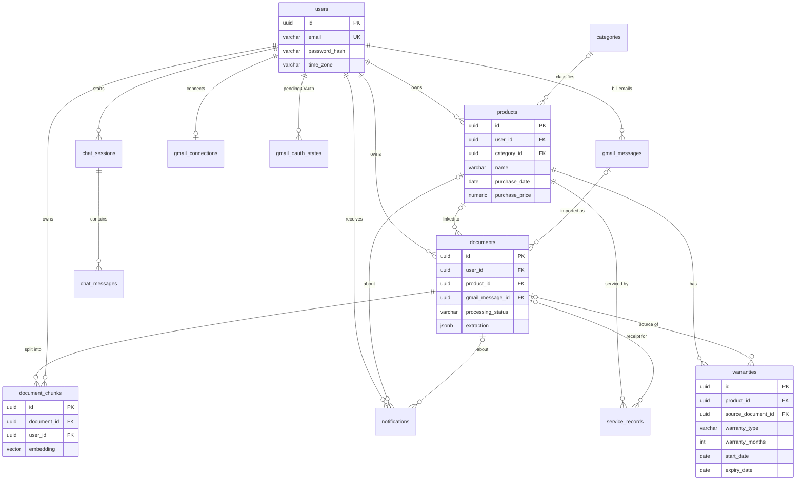

# Bill Locker — Database design

The database is designed as **JPA entity classes** in `backend/`
(package `project.bill_locker`). When the backend starts, Hibernate creates and
updates the tables in PostgreSQL from these classes
(`spring.jpa.hibernate.ddl-auto=update`). There are no SQL migration scripts.
The schema backs the REST contract in [`api-contract.md`](api-contract.md).

> **What exists today (step 7):** `users`, `documents`, `document_files`,
> `categories`, `products`, `warranties`, `service_records`, `notifications`,
> `gmail_connections`, `gmail_oauth_states` and `gmail_messages`.
> - The file bytes are in `document_files.data` (bytea); see
>   [`step-3-backend-basics.md`](step-3-backend-basics.md) §3.
> - Step 4 added `processing_stage`, `error_message`, `extracted_text` and
>   `extraction` (jsonb) to `documents`; see
>   [`step-4-reading-documents.md`](step-4-reading-documents.md) §6.
> - Step 5 added the product tables and `documents.product_id`; see
>   [`step-5-products-and-warranties.md`](step-5-products-and-warranties.md) §4 and §8.
>   Differences from the target below: one warranty per product (unique
>   `uk_warranties_product`), no `warranty_type`/`coverage_note` yet, and no
>   `(user_id, category_id)` index yet.
> - Step 6 added `service_records` and `notifications`; see
>   [`step-6-services-reminders-search.md`](step-6-services-reminders-search.md) §6.
>   Compared with the target: no `document_id` (receipt) on service records, no
>   `read_at` on notifications, and no `users.time_zone` (reminders use the server's date).
> - Step 7 added the Gmail tables and `documents.source` / `documents.gmail_message_id`;
>   see [`step-7-codes-and-gmail.md`](step-7-codes-and-gmail.md) §6. Compared with the
>   target: no `token_key_version`, `granted_scopes` or `last_history_id` on connections.
>
> Everything below §1 is the **target design**. Its entity classes and tests are
> saved at the git tag `step-2-database` and come back one feature at a time. When a
> part returns, update this document.

| What | Where |
|---|---|
| Entity classes | `backend/src/main/java/project/bill_locker/<package>/` |
| Database settings | `backend/src/main/resources/application.properties` + `backend/.env` |
| Full target entity model, pgvector setup (`schema.sql`), default categories, mapping tests | tag `step-2-database` |

---

## 1. Connect the backend to your local PostgreSQL

1. Create an empty database named `BillLocker`. Hibernate creates the tables but
   not the database itself. In pgAdmin use Databases → Create → Database…, or in
   psql run `CREATE DATABASE "BillLocker";` (the quotes keep the capitals).
2. Copy `backend/.env.example` to `backend/.env` and fill it in. The `.env` file
   is git-ignored, so never commit a real password. The username is a
   PostgreSQL login role (usually `postgres`), not the database name.
   ```properties
   DATABASE_URL=jdbc:postgresql://localhost:5432/BillLocker
   DATABASE_USERNAME=postgres
   DATABASE_PASSWORD=your-password
   ```
   Environment variables with the same names take precedence over the file.
3. Start the backend. In IntelliJ IDEA, open the repository root and run the
   **Backend** run configuration. From a terminal:
   ```bash
   cd backend
   ./mvnw spring-boot:run        # PowerShell: .\mvnw.cmd spring-boot:run
   ```
   `backend/.env` is found whether the app starts in `backend/` or in the
   repository root.

On every start, Hibernate creates any missing tables, columns, foreign keys,
indexes and unique constraints. Restarting is safe: nothing is duplicated or
dropped. (With the target design, `schema.sql` also enables pgvector and
`DefaultCategories` inserts the 9 categories.)

### pgvector (needed later, for AI document search)

Today's code doesn't use pgvector. The AI search step will need it for the
`document_chunks` table. At the `step-2-database` tag the backend still starts
without it: every table except `document_chunks` is created, and the log says why
that table is missing.

To install pgvector for PostgreSQL 17 on Windows:

1. Install **Build Tools for Visual Studio** with the "Desktop development with C++"
   workload.
2. Open **x64 Native Tools Command Prompt for VS** *as Administrator* and run:
   ```bat
   set "PGROOT=C:\Program Files\PostgreSQL\17"
   cd %TEMP%
   git clone --branch v0.8.6 https://github.com/pgvector/pgvector.git
   cd pgvector
   nmake /F Makefile.win
   nmake /F Makefile.win install
   ```
3. Restart the backend. `schema.sql` enables the extension and Hibernate creates
   `document_chunks`. PostgreSQL itself does not need a restart.

---

## 2. Entity-relationship diagram



---

## 3. Entities

Every entity except `GmailOAuthState` (keyed by its OAuth `state` string)
extends a shared base class:

- `common.BaseEntity`: `id` (UUID generated by Hibernate) and `created_at`.
  `equals`/`hashCode` compare ids and handle Hibernate proxies.
- `common.AuditableEntity`: adds `updated_at`, set in `@PrePersist`/`@PreUpdate`.

| Entity (package) | Table | Holds |
|---|---|---|
| `user.User` | `users` | Account; email stored lower-case (unique), BCrypt hash, IANA time zone |
| `product.Category` | `categories` | 9 fixed categories (slug drives the frontend icon) |
| `product.Product` | `products` | Something the user owns; warranties and services hang off it |
| `warranty.Warranty` | `warranties` | Standard, extended or component cover for a product |
| `service.ServiceRecord` | `service_records` | Maintenance/repair history and the next due date |
| `document.Document` | `documents` | A bill/warranty card/receipt: file metadata, OCR text, AI extraction |
| `notification.Notification` | `notifications` | In-app reminders (warranty, service, processing, Gmail) |
| `rag.DocumentChunk` | `document_chunks` | Text chunks + 768-dimension embeddings for AI search |
| `ai.ChatSession` / `ai.ChatMessage` | `chat_sessions` / `chat_messages` | "Ask your locker" conversations with citations |
| `gmail.GmailConnection` | `gmail_connections` | One Gmail account per user, encrypted refresh token, sync state |
| `gmail.GmailMessage` | `gmail_messages` | Emails the scan shortlisted as bills (metadata only) |
| `gmail.GmailOAuthState` | `gmail_oauth_states` | Short-lived OAuth `state` + PKCE verifier |

These value types are stored as **JSONB** with `@JdbcTypeCode(SqlTypes.JSON)`:

- `document.ExtractionResult` in `documents.extraction`
- `List<ai.ChatCitation>` in `chat_messages.citations`
- `List<gmail.GmailAttachment>` in `gmail_messages.attachments`
- `Map<String, Object>` in `document_chunks.metadata`

### Columns

Money is `numeric(12,2)` (`BigDecimal`). Calendar dates are `date`
(`LocalDate`). Instants are `timestamptz` (`Instant`, stored in UTC). Enums are
`varchar`.

**users**: `name` (2–80), `email` (254, unique `uk_users_email`),
`password_hash` (255), `time_zone` (64, default `Asia/Kolkata`).

**categories**: `name` (60, unique), `slug` (40, unique, `^[a-z0-9-]+$`),
`sort_order`. The slugs are `mobile-phones`, `computers`, `tv-entertainment`,
`audio`, `home-appliances`, `kitchen`, `furniture`, `vehicles` and `other`.

**products**
| Column | Type | Notes |
|---|---|---|
| user_id | uuid → users | required |
| category_id | uuid → categories | optional |
| name | varchar(120) | required |
| brand, model, serial_number | varchar(80) | optional |
| purchase_date | date | |
| purchase_price | numeric(12,2) | ≥ 0 |
| currency | varchar(3) | `^[A-Z]{3}$`, default `INR` |
| seller | varchar(120) | |
| invoice_number | varchar(80) | |

Indexes: `(user_id, created_at DESC)` and `(user_id, category_id)`.

**warranties**
| Column | Type | Notes |
|---|---|---|
| product_id | uuid → products | required |
| warranty_type | varchar(20) | `STANDARD`, `EXTENDED`, `COMPONENT` |
| coverage_note | varchar(200) | e.g. "Digital inverter compressor" |
| warranty_months | int | 0–240; `NULL` or `0` means unknown |
| start_date | date | usually the purchase or delivery date |
| expiry_date | date | **derived**: start + months − 1 day, `NULL` when unknown |
| source_document_id | uuid → documents | the warranty card or invoice it came from |

**documents**
| Column | Type | Notes |
|---|---|---|
| user_id | uuid → users | required |
| product_id | uuid → products | set when the user confirms |
| gmail_message_id | uuid → gmail_messages | Gmail imports only |
| document_type | varchar(20) | `INVOICE`, `WARRANTY_CARD`, `SERVICE_RECEIPT`, `REPAIR_RECEIPT`, `OTHER` |
| file_name | varchar(255) | no `/` or `\` |
| storage_key | varchar(512) | unique object key in MinIO/S3 (the file is not in the DB) |
| mime_type | varchar(100) | `application/pdf`, `image/jpeg`, `image/png`, `image/webp` |
| file_size | bigint | > 0 |
| content_hash | varchar(64) | SHA-256 hex, used to detect duplicate uploads |
| source | varchar(10) | `UPLOAD`, `GMAIL` |
| processing_status | varchar(20) | `UPLOADED`, `PROCESSING`, `PROCESSED`, `REVIEW_REQUIRED`, `CONFIRMED`, `FAILED` |
| processing_stage | varchar(12) | `OCR`, `EXTRACTION`, `INDEXING` |
| processing_attempts | int | |
| error_message | varchar(500) | user-readable failure reason |
| extracted_text | text | OCR output |
| extraction | jsonb | `ExtractionResult` including per-field `confidence` |
| ai_model | varchar(100) | |
| processed_at, confirmed_at | timestamptz | |

Indexes: `(user_id, created_at DESC)`, `(user_id, processing_status)`,
`(product_id)`, `(user_id, content_hash)` and `(gmail_message_id)`.

**service_records**:
- `product_id` (required) and `document_id` (optional receipt).
- `service_date` (required) and `service_type`: `ROUTINE_MAINTENANCE`, `REPAIR`,
  `INSTALLATION`, `INSPECTION` or `OTHER`.
- `service_center` (120), `cost` (≥ 0), `notes` (500).
- `next_service_date` (must be after `service_date`).
- Indexes: `(product_id, service_date DESC)` and `(next_service_date)`.

**notifications**:
- `user_id` (required), plus optional `product_id` and `document_id`.
- `type`: `WARRANTY_EXPIRING`, `WARRANTY_EXPIRED`, `SERVICE_DUE`,
  `DOCUMENT_PROCESSED` or `GMAIL_BILLS_FOUND`.
- `title` (120) and `message` (500).
- `scheduled_at` (defaults to now), `is_read`, `read_at`.
- `dedupe_key` (160), unique per user (`uk_notifications_dedupe`).

**document_chunks**:
- `document_id` and `user_id`. `user_id` is copied from the document, so searches
  filter by user without a join.
- `chunk_index` (unique per document) and `chunk_text` (text).
- `embedding` `vector(768)` and `embedding_model` (100).
- `page_number` and `metadata` (jsonb).

**chat_sessions**: `user_id` and `title` (120). `updated_at` sorts the list.

**chat_messages**:
- `session_id`, `role` (`USER`, `ASSISTANT`) and `content` (text, ≤ 20,000).
- `citations` (jsonb). This is the API's `references`, renamed because
  `REFERENCES` is an SQL keyword.
- Assistant replies also store `ai_model`, `prompt_tokens`, `completion_tokens`
  and `latency_ms`.

**gmail_connections**:
- `user_id` (unique: one connection per user) and `email`.
- `refresh_token_ciphertext` (bytea, AES-GCM; the plain token is never stored)
  and `token_key_version` for key rotation.
- `granted_scopes` and `auto_sync`.
- Sync state: `sync_status` (`IDLE`, `SYNCING`, `ERROR`), `sync_started_at`,
  `last_synced_at`, `last_history_id` (for incremental scans) and `last_error`.

**gmail_messages**:
- `gmail_message_id` (unique per user) and `gmail_thread_id`.
- `from_name`, `from_email`, `subject`, `snippet` and `received_at`.
- `attachments` (jsonb).
- `detected_type`, `confidence` (0–1) and `status` (`NEW`, `IMPORTED`, `IGNORED`).
- **Email bodies are never stored.**

**gmail_oauth_states**: `state` (primary key), `user_id`, `code_verifier`
(PKCE), `expires_at` and `created_at`. The OAuth callback carries no JWT, so the
`state` identifies the user. Delete the row once it is used, and purge expired
rows.

---

## 4. Rules built into the entities

1. **Warranty expiry is computed by code, never typed in.** The rule lives in
   `WarrantyDates.expiryDate`: start + months − 1 day. For example, 24 months from
   2026-09-15 covers up to 2028-09-14. Month ends clamp: 31 Jan + 1 month gives
   28 Feb, so expiry is 27 Feb. `Warranty` recomputes `expiry_date` whenever the
   months or start date change, and again in `@PrePersist`/`@PreUpdate`.
   `expiryDate` has no setter.
2. **Warranty status is never stored.** It depends on today's date, so a stored
   column would go stale every midnight. Compute it with
   `warranty.statusOn(user.today(clock))`:
   - `UNKNOWN`: no expiry date.
   - `EXPIRED`: the expiry date has passed.
   - `EXPIRING_SOON`: 0–30 days left.
   - `ACTIVE`: more than 30 days left.

   `user.today(clock)` uses the user's time zone. On a UTC server "today" would
   otherwise be a day behind for Indian users between 00:00 and 05:30 IST.
3. **One headline warranty per product.** `Product.headlineWarranty()` is the
   standard or extended cover that runs longest; the API returns it as
   `Product.warranty`. Component-only cover (e.g. "10 years on compressor") never
   makes the whole product look covered. Keep at most one `STANDARD` warranty per
   product in the service layer.
4. **AI output is not data until the user confirms.** The AI extraction waits in
   `documents.extraction`. Only the review screen's "Confirm & Save" calls
   `Document.confirm(product, type)` and writes the `Product`/`Warranty` rows.
   Missing values stay `null` and display as "Not found".
5. **Never lose a bill.** Deleting a product unlinks its documents instead of
   deleting them (see §5).
6. **Every row belongs to a user.**
   - Products, documents, notifications, chats and Gmail rows point to `users`
     directly.
   - Warranties and service records belong to a user through their product.
   - Every repository query must filter by the user from the JWT.
   - Before linking two rows, the service layer must check that both belong to
     the same user, because the database does not enforce it.
7. **Background jobs are idempotent.**
   - Reminders are unique on `(user_id, dedupe_key)`.
   - Gmail emails are unique on `(user_id, gmail_message_id)`.
   - Re-running the reminder job or a scan fails on the unique constraint instead
     of creating duplicates, so catch `DataIntegrityViolationException`.

   The reminder job must use exactly these dedupe keys:

   | Type | Dedupe key |
   |---|---|
   | WARRANTY_EXPIRING | `WARRANTY_EXPIRING:<warranty id>:<expiry date>` |
   | WARRANTY_EXPIRED | `WARRANTY_EXPIRED:<warranty id>:<expiry date>` |
   | SERVICE_DUE | `SERVICE_DUE:<service record id>:<next service date>` |
   | DOCUMENT_PROCESSED | `DOCUMENT_PROCESSED:<document id>:<attempt>` |
   | GMAIL_BILLS_FOUND | `GMAIL_BILLS_FOUND:<user id>:<scan number>` |
8. **Validation lives on the fields.** Bean Validation annotations (`@NotBlank`,
   `@Size`, `@Pattern`, `@Min`/`@Max` and so on) are checked before every insert
   and update. They also shape the generated columns: `NOT NULL`, lengths, and
   `CHECK (warranty_months BETWEEN 0 AND 240)`.
9. **Enums are stored as text.** `@Enumerated(STRING)` columns get a Hibernate
   CHECK constraint that lists the allowed values, named
   `<table>_<column>_check` (e.g. `documents_document_type_check`).

---

## 5. What happens on delete

Delete rules are declared with `@OnDelete`, so PostgreSQL enforces them
(`ON DELETE CASCADE` / `SET NULL`). They apply even to rows the application
never loaded.

| When this is deleted | Rows that reference it | Result |
|---|---|---|
| User | products, documents, notifications, chunks, chats, Gmail rows | deleted (the account and all its data) |
| Product | warranties, service records, notifications | deleted |
| Product | **documents** | **kept**, `product_id` becomes `NULL` |
| Document | chunks, notifications | deleted |
| Document | warranties (`source_document_id`), service records (`document_id`) | kept, reference becomes `NULL` |
| Gmail message | documents imported from it | kept, `gmail_message_id` becomes `NULL` |
| Category | products | kept, `category_id` becomes `NULL` |
| Chat session | messages | deleted |

Notes for the service layer:

- Deleting a user must also delete their files from object storage. The
  database cascade cannot reach MinIO/S3.
- Hibernate does not see changes the database makes on its own. If a
  transaction has already loaded rows that point at something you delete, unlink
  them first. `Product` and `GmailMessage` already do this for their documents in
  `@PreRemove`.

---

## 6. Changing entities: what `ddl-auto=update` does and doesn't do

On startup `update` **adds** missing tables, columns, foreign keys, indexes and
unique constraints. It **never**:

- **drops or renames columns.** Renaming a field creates a new column and leaves
  the old one in place. If the old column was `NOT NULL`, inserts start failing.
- **changes a column's type or length.** A new `@Size`/`length` is not applied to
  an existing table.
- **updates CHECK constraints.** After adding an enum constant, drop the old
  constraint once, for example
  `ALTER TABLE documents DROP CONSTRAINT documents_document_type_check;`.
  Hibernate does not add it back to an existing column.
- **adds a `NOT NULL` column to a table that already has rows.** Make the new
  column nullable, or fill it first.

To reset the development database, run `DROP DATABASE "BillLocker";` and
`CREATE DATABASE "BillLocker";`, then restart the backend.

---

## 7. Querying

Always bind the user from the authenticated JWT.

**RAG retrieval.** `hibernate-vector` provides `cosine_distance` in HQL. This
query is covered by `EntityMappingTests`:

```java
em.createQuery("""
        select c from DocumentChunk c
        where c.user = :user
        order by cosine_distance(c.embedding, :query)""", DocumentChunk.class)
    .setParameter("user", user)
    .setParameter("query", queryEmbedding)   // float[768]
    .setMaxResults(8)
    .getResultList();
```

- Filter by `embeddingModel` too while two models coexist.
- For exact tokens such as serial or invoice numbers, add a keyword search:
  `ILIKE`, or a native full-text query on `chunk_text`.

**Natural-language search.** The LLM only produces `SearchFilters`. The backend
builds a parameterised query from the validated filters. Never execute
LLM-generated SQL.

**RAG notes**
- **There is no vector (HNSW) index yet.** An approximate index ranks every
  user's chunks and filters by `user_id` afterwards, so it can return too few
  results for one user. At personal-locker scale, filtering by user and then
  ranking exactly is fast and always complete. Add an HNSW index only when volume
  requires it.
- **Changing the embedding size** means updating
  `DocumentChunk.EMBEDDING_DIMENSIONS`, dropping `document_chunks` (`update` won't
  change the column type), restarting, and re-embedding every document.
- Suggested chunking: about 800–1,200 characters with about 150 characters of
  overlap, keeping page numbers.

---

## 8. Security & privacy

- **Passwords** are stored only as BCrypt hashes.
- **Google refresh tokens** are stored only as AES-GCM ciphertext. The key comes
  from an environment variable and is never in the database.
- **Data minimisation:** Gmail rows keep metadata, not email bodies. Files live
  in object storage, not in the database.
- **Isolation:** every query filters by the JWT user. Tests must try
  cross-user access, including RAG chunks.
- **Secrets:** the database password lives in `backend/.env` or environment
  variables, never in `application.properties` or git.

---

## 9. Tests

All backend tests run against a real PostgreSQL 17 that Testcontainers starts in
Docker (`pgvector/pgvector:pg17`). They never touch your local database. Run
them in `backend/` with `./mvnw test` (PowerShell: `.\mvnw.cmd test`). Docker
Desktop must be running. Today's tests are listed in
[`step-3-backend-basics.md`](step-3-backend-basics.md) §7. `EntityMappingTests`,
for the full target model, is at the `step-2-database` tag.

The tests cover:
- every table and column type (`uuid`, `jsonb`, `vector`) and the seeded
  categories
- saving a product with its warranty and service history
- the expiry rule, including month ends
- "today" in the user's time zone
- component cover never becoming the headline warranty
- JSON round-trips
- the delete rules
- deleting a product keeps its bills
- deleting a user removes all their data
- user-scoped vector search
- duplicate reminders being rejected

---

## 10. Not built yet

- **Demo data:** seeding `demo@billlocker.app` / `Demo@1234` with the same
  products as `frontend/src/mocks/seed.ts` belongs to the backend phase (a dev-only
  startup runner).
- **Shopping-app imports** (research paused): `purchase_sources` and
  `imported_orders` (unique per user + app + order id) would feed the same review
  pipeline.
- **Extraction audit:** one row per AI attempt (prompt version, raw response,
  latency) for debugging and evaluation.
- **Return windows** for fashion and quick-commerce purchases, shown next to
  warranties.
